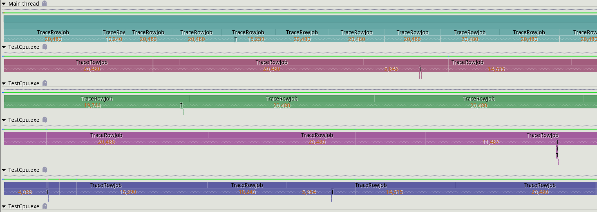
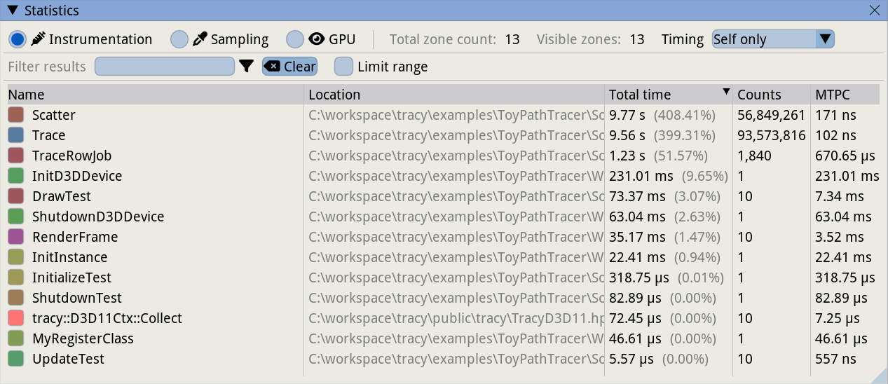
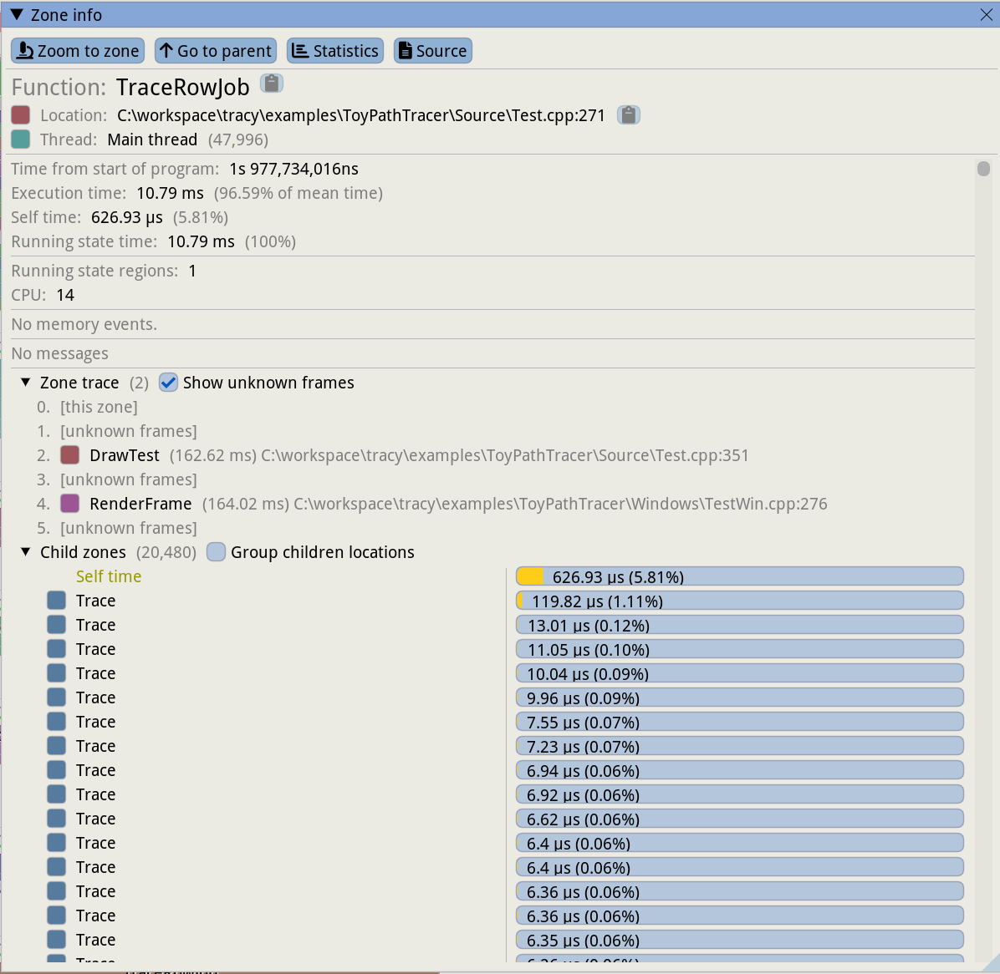
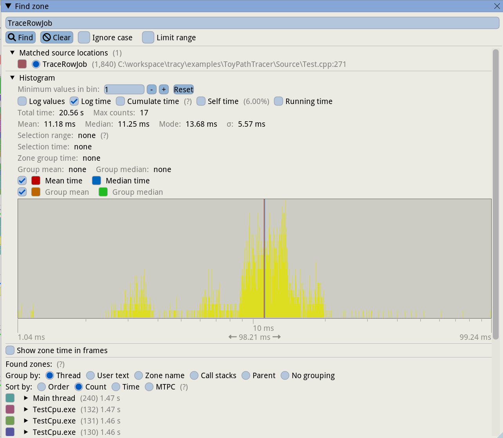
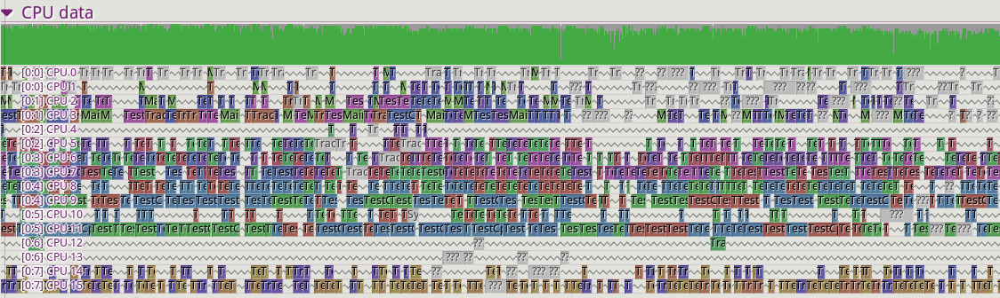

## Tracing profilers
Most of the tools explored so far fall under the category of sampling profilers. These are great when you want to identify hot-spots in your code, but in some cases they might not provide enough granularity for analysis. Depending on the profiler sampling frequency and the behavior of your program, most functions could be fast enough that they don't show up in a profiler. In some scenarios you might want to manually define which parts of your program need to be measured consistently. This is true, for instance, with video games. As a brief overview, video games render frames (the final image shown on screen) on average at 60 frames per second (FPS), however some monitors allow up to 144 FPS. This means each frame could have between as little as 2.4 milliseconds to complete the work before moving on to the next one. Developers pay particular attention to frames that go above this threshold, as this causes visible stutter in game and can ruin the player experience. This situation is hard to capture with a sampling profiler, as they usually only provide the total time taken for a given function.

For this reasons, developers have created profilers that allow you to manually instrument your code. These profilers give you the ability to insert profiling sections in your program so that you can define exactly which functions or methods to track. There are a few tools in this space: some are integrated directly into game engines like Unreal, while others are provided as external libraries that can be integrated into each project. Some of the most commonly used profilers are Tracy (https://github.com/wolfpld/tracy), Remotery (https://github.com/Celtoys/Remotery) and Optick (https://github.com/bombomby/optick, Windows only).

We are going to focus on Tracy, as this seems to be one the more popular projects, however these concepts apply to the other profilers as well. Profiling a section of code is really simple: you just need to import Tracy's header and add a `ZoneScoped` macro to the functions you want to track:

```c++
#include "tracy/Tracy.hpp"

void Trace()
{
    ZoneScoped;

    if (...)
    {
        Scatter();
    }
}

void TraceRowJob()
{
    ZoneScoped;

    for(...)
    {
        Trace();
    }
}

void DrawTest()
{
    ZoneScoped;

    for (...)
    {
        TraceRowJob();
    }
}

void RenderFrame()
{
    ZoneScoped;

    DrawTest();

    FrameMark;
}
```

A [full example](https://github.com/wolfpld/tracy/tree/master/examples/ToyPathTracer) that shows how to use the Tracy API is provided in the official repository.

The `ZoneScoped` macro creates an object on the stack that will record the runtime activity of the code within its scope. Tracy refers to this scope as "zone". At the zone entry, the current timestamp is captured. Once the function exits, the object will record a new timestamp and will store this timing data along with a few other details, including the function name. The implementation has very little overhead - it has been measured to be 2.25ns per zone - although care must be taken when profiling certain sections of the code like tight loops.

Tracy has two operation modes: it can store all the timing data until the profiler is connected to the application, or it can simply discard the data and start recording only when a profiler is connected. The latter is usually the preferred option, as it means the tracing code can be compiled into the application and it will cause little to no overhead to the running program unless the profiler is attached.

The profiler is a separate application that connects to a running application to record and display the live profiling data. The profiler can be run on a separate machine so that it doesn't interfere with the running application. Here is an example of the profiler output:

{#fig:Tracy_Main_View width=90%}

The profiler provides plenty of details. The main view shows the graph for all the zones that were active during a given frame. A histogram for displaying the times for all the recorded frames is displayed above the main view, which makes it easier to spot a long running frame (the red bar in the picture) that could cause stutter.

{#fig:Tracy_Frame_Time_View width=90%}

Memory allocations can be manually tracked as well, and are displayed in a separate window. This can be useful to spot memory leaks or to determine which code in the application is responsible for a given memory allocation. Tracy allows to track separate memory pools as well, which can be useful if multiple allocators are being used.

We can inspect the statistics for the data recorded so far, including the total time a given function function was active, how many times it was invoked, etc. It's also possible to select a time range in the main view an analyze the statistics only for that time interval.

{#fig:Tracy_Statistics_View width=90%}

The next image shows the details for a give zone:

{#fig:Tracy_Zone_Details width=90%}

Finally, we show the time histogram for a given zone. This is particularly useful to determine how much variation there is when executing a function:

{#fig:Tracy_Zone_Timing width=90%}

By default, Tracy tracks other details about the profiled system and application, including threads that have not been explicitly profiled. It also behaves like a traditional sampling profiler as it reports data for applications that are running concurrently to the profiled program. It also tracks which core a given thread is executing on and it displays context switches when hovering the mouse on a given section in the CPU data view:

{#fig:Tracy_System_View width=90%}

If debug symbols are available, Tracy can also display hotspots in the source code and related assembly:

{#fig:Tracy_Source View width=90%}

It's also possible to capture a trace without using the profiler UI. This can be done with the following command:
`./capture -a 127.0.0.1 -o trace.tracy -s 60`
This will capture an application running on the local machine for 60 seconds, and will store the profiling data in a file called `trace.tracy`. The profile data can be inspected using the profiler UI described above.

Tracy provides many other features, too many to cover in this overview. They include:
- naming threads
- timing and tracking locks
- session comparison: this is vital to ensure a change provides the expected benefits. It's possible to load two profiling sessions and compare the timings for a given zone.
- graphics API profiling: Tracy supports OpenGL, Vulkan and DirectX. Much like with CPU code, it's possible to insert profiling markers in the GPU command stream. The GPU driver will report the time taken to execute in between markers and Tracy will display the information in the profiler.

Tracy provides a detailed [user manual](https://github.com/wolfpld/tracy/releases/download/v0.9/tracy.pdf) which goes into each feature's detail. The author also provides an interactive demo if you'd like to get a feel for the capabilities of this tool: https://tracy.nereid.pl/.
