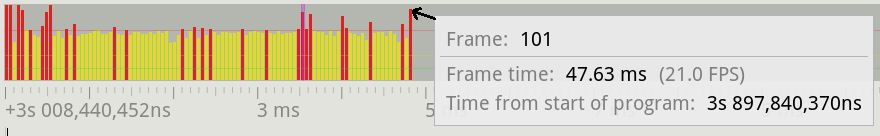
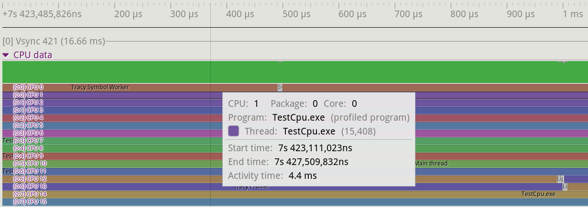
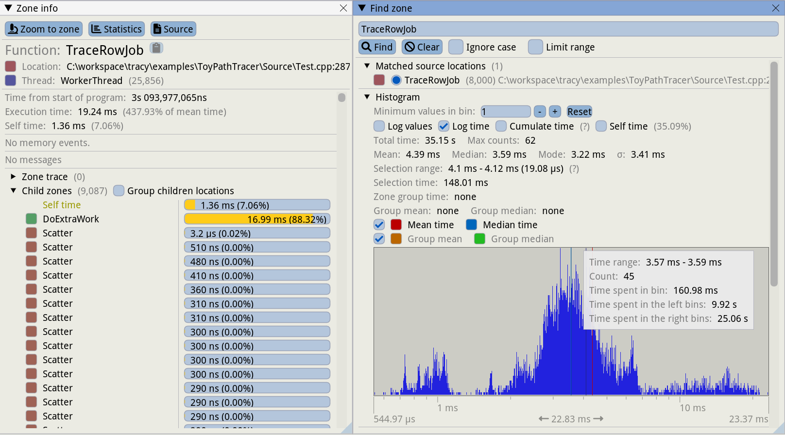

## Specialized and Hybrid profilers

Most of the tools explored so far fall under the category of sampling profilers. These are great when you want to identify hot-spots in your code, but in some cases they might not provide enough granularity for analysis. Depending on the profiler sampling frequency and the behavior of your program, most functions could be fast enough that they don't show up in a profiler. In some scenarios you might want to manually define which parts of your program need to be measured consistently. Video games, for instance, render frames (the final image shown on screen) on average at 60 frames per second (FPS); some monitors allow up to 144 FPS. At 60 FPS, each frame has as little as 16 milliseconds to complete the work before moving on to the next one. Developers pay particular attention to frames that go above this threshold, as this causes visible stutter in games and can ruin the player experience. This situation is hard to capture with a sampling profiler, as they usually only provide the total time taken for a given function.

Developers have created profilers that provide features helpful in specific environments, usually with a marker API that you can use to manually instrument your code. This allows you to observe performance of a particular function or a block of code (later refered as a *zone*). Continuing with the game industry, there are a few tools in this space: some are integrated directly into game engines like Unreal, while others are provided as external libraries and tools that can be integrated into your project. Some of the most commonly used profilers are [Tracy](https://github.com/wolfpld/tracy), RAD Telemetry, [Remotery](https://github.com/Celtoys/Remotery), and [Optick](https://github.com/bombomby/optick) (Windows only).

Next, we showcase Tracy, as this seems to be one the more popular projects, however these concepts apply to the other profilers as well. Instrumenting a section of code is really simple: you just need to import Tracy's header and add a `ZoneScoped` macro to the functions you want to track, see [@lst:TracyInstrumentation].

Listing: Tracy Instrumentation

~~~~ {#lst:TracyInstrumentation .cpp}
#include "tracy/Tracy.hpp"

void TraceRowJob() {
  ZoneScoped;

  if (frameCount == randomlySelected)
    DoExtraWork();

  // ...
}

void RenderFrame() {
  ZoneScoped;
  for (...) {
    TraceRowJob();
  }
  FrameMark;
}
~~~~~~~~~~~~~~~~~~~~~~~~~~~~~~~~~~~~~~~~~~~~~~~~~

The [full example](https://github.com/wolfpld/tracy/tree/master/examples/ToyPathTracer) that shows how to use the Tracy API is provided in the official Tracy repository on Github. This example implements a simple path tracer, a technique similar to ray-tracing that shoots thousands of rays per pixel into the scene to render a realistic image. To process the full frame, the implementation distributes the processing of each row of pixels to a separate thread. The `FrameMark` macro can be inserted to identify individual frames in the profiler. Each frame can contain many zones, whose borders are identified by the `ZoneScoped` macro. The `FrameMark` macro is used to identify the time interval of a frame on the timeline.

The `ZoneScoped` macro creates an object on the stack that will record the runtime activity of the code within the scope of the object. Tracy refers to this scope as a "zone". At the zone entry, the current timestamp is captured. Once the function exits, the object will record a new timestamp and will store this timing data, along with a few other details, including the function name. It's hard to estimate the Tracy overhead, as it depends on how many zones you have inserted. On a sampled program that does image compression, the author of Tracy measured an overhead of 18% and 34% with two different compression schemes. A total of 200M zones were profiled, with an average overhead of 2.25 ns per zone. This test instrumented a very hot function. In other scenarios the overhead will be much lower. While it's possible to keep the overhead small, you need to be careful about which sections of code you want to instrument, especially if you decide to use it in production.

Tracy has two operation modes: it can store all the timing data until the profiler is connected to the application (the default mode), or it can simply discard the profiling data and start recording only when a profiler is connected. This option can be enabled by specifying the `TRACY_ON_DEMAND` pre-processor macro when compiling the application. The latter is the preferred option if you want to distribute an application that can be profiled as needed. With this option, the tracing code can be compiled into the application and it will cause little to no overhead to the running program unless the profiler is attached. The profiler is a separate application that connects to a running application to capture and display the live profiling data, aka the "flight recorder" mode. The profiler can be run on a separate machine so that it doesn't interfere with the running application. Note, however, that this doesn't mean that the runtime overhead caused by the instrumentation code disappears - it is still there, but the overhead of visualizing the data is avoided in this case.

Tracy graphical interface is quite rich, unfortunately too hard to fit on a single screenshot, so we break it down into pieces. Figure @fig:Tracy_Main_View shows a timeline view when profiling the code in [@lst:TracyInstrumentation]. It shows the graph for all the zones that were active during a given frame. In the image we can see the Main Thread and 5 worker threads (WorkerThread). All threads, including the main thread, are performing work to advance progress in rendering the final image. In this example, each thread processes a row of pixels inside the `TraceRowJob` zone. The `TraceRowJob` zone contains many smaller zones, whose name cannot be displayed in the profiler. When this happens, Tracy collapses the small zones and only shows the number of active zones - this is what `4,109` stands for under the first `TraceRowJob` in the Main Thread.

{#fig:Tracy_Main_View width=100%}

Right above the main panel, there is a histogram that displays the times for all the recorded frames, see figure @fig:Tracy_Frame_Time_View. It makes it easier to spot a long running frame that could cause stutter. It makes it easier to spot those frames that took longer than average to complete. In this example, most frames take around 33 ms (the yellow bars). However there are some frames that take longer than this and are marked in red. As can be seen in the screenshot, a tooltip showing the details of a given frame is displayed when hovering the mouse on the bar in the histogram.

{#fig:Tracy_Frame_Time_View width=90%}

Figure @fig:Tracy_CPU_Data illustrates the CPU data section of the profiler. This area shows which core a given thread is executing on and it also displays context switches. This section will also display other programs that are running on the CPU. As seen in the image, the details for a given thread are displayed when hovering the mouse on a given section in the CPU data view. Details include the CPU the thread is running on, the parent program, the individual thread and timing information. In this example, we can see that the `TestCpu.exe` thread was active for 4.4 ms on CPU 1.

{#fig:Tracy_CPU_Data width=100%}

The next image shows the views that provide more details about where your program spends its time and that allow you to analyze individual zones in more depth:

{#fig:Tracy_Zone_Details width=100%}

In the Statistics window (1) we can analyze the statistics for the data recorded, including the total time a given function function was active, how many times it was invoked, etc. It's also possible to select a time range in the main view an analyze the statistics only for that time interval.

The Zone Info window (2) shows the details for a zone and how much of the execution time is due to the zone itself or its children. In this example, execution of the `TraceRowJob` function itself (without it's callees) in the current zone takes only 1.36 ms, which is 7.06% of the whole zone. The time for the zone including the child zones is 19.24 ms. This view also shows the source file and line of code where the zone starts. In this instance of the TraceRowJob zone, we can see a call to `DoExtraWork` that takes a long time to execute. In this view we can see that it took 16.99 ms for it to complete. We can click on the `DoExtraWork` row in the Child Zones section of this view. This will update the Zone Info view with the details of the slow zone so that we can inspect the data and try to understand what caused the performance issue.

Clicking on the "Statistics" button will display the Find Zone window (3). Here we can see the time histogram for a zone. This is particularly useful to determine how much variation there is when executing a function. Looking at the histogram on the right, we see that the median duration for `TraceRowJob` is 3.59 ms, with most calls taking between 1 and 7 ms. However there are a few instances that take longer than 10 ms (note that the time axis is logarithmic), with a peak of 23 ms.

Now we can examine other slow instances to find what is common between them, which will help us to root cause the issue. From this view you can select one of the slow zones. This will update the Zone Info window (2) with the details of that zone instance and by clicking the "Zoom To zone" button, the main window will focus on this slow zone. This information should should help you root cause the performance issue. The Find Zone window (3) also provides other data points, including the mean, median and standard deviation for the inspected zone.

[TODO:] By default, Tracy monitors performance of the whole system, not just the application itself. It also behaves like a traditional sampling profiler as it reports data for applications that are running concurrently to the profiled program. The tool monitors thread migration and idle time by tracing kernel context switches (administrator privileges are required). Zone statistics (call counts, time, histogram) are exact because Tracy captures every zone entry/exit, but system-level data and source-code-level data are sampled.

If debug symbols are available, Tracy can also display hotspots in the source code and related assembly:

{#fig:Tracy_Source_View width=100%}

It's also possible to capture a trace without using the profiler UI. This can be done with the following command: `./capture -a 127.0.0.1 -o trace.tracy -s 60` This will capture an application running on the local machine for 60 seconds, and will store the profiling data in a file called `trace.tracy`. The profile data can be inspected using the profiler UI described above.

Tracy provides many other features, too many to cover in this overview. They include:
- naming threads
- timing and tracking locks
- tracking memory allocations. This can be useful to spot memory leaks or to determine which code in the application is responsible for a given memory allocation. Tracy allows to track separate memory pools as well, which can be useful if multiple allocators are being used.
- session comparison: this is vital to ensure a change provides the expected benefits. It's possible to load two profiling sessions and compare zone data before and after the change was made.
- graphics API profiling: Tracy supports OpenGL, Vulkan and DirectX. Much like with CPU code, it's possible to insert profiling markers in the GPU command stream. The GPU driver will report the time taken to execute in between markers and Tracy will display the information in the profiler.

Tracy provides a detailed [user manual](https://github.com/wolfpld/tracy/releases/latest/download/tracy.pdf) which goes into each feature in detail. The author also provides an interactive demo if you would like to get a feel for the capabilities of this tool: https://tracy.nereid.pl/.

[TODO:] From the Doc about Tracy features: "For example, statistical information about zones, trace comparisons, or inclusion of inline function frames in call stacks"

[TODO:] From the Doc about Tracy features: "Tracy doesn’t require manual markup of interesting areas in your code to start profiling. Instead, you may rely on automated call stack sampling and add instrumentation later when you know where it’s needed"

[TODO:] Tracy does not leverage all the HW features specific to a particular platform. For example, you cannot get the same level of CPU microarchitectural insights (e.g. various performance events) as you get on other tools like Intel Vtune and AMD uProf.
