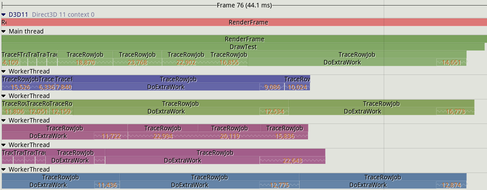
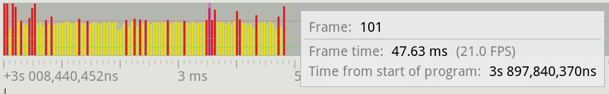

## Specialized and Hybrid profilers

Most of the tools explored so far fall under the category of sampling profilers. These are great when you want to identify hot-spots in your code, but in some cases they might not provide enough granularity for analysis. Depending on the profiler sampling frequency and the behavior of your program, most functions could be fast enough that they don't show up in a profiler. In some scenarios you might want to manually define which parts of your program need to be measured consistently. Video games, for instance, render frames (the final image shown on screen) on average at 60 frames per second (FPS); some monitors allow up to 144 FPS. At 60 FPS, each frame has as little as 16 milliseconds to complete the work before moving on to the next one. Developers pay particular attention to frames that go above this threshold, as this causes visible stutter in games and can ruin the player experience. This situation is hard to capture with a sampling profiler, as they usually only provide the total time taken for a given function.

Developers have created profilers that provide features helpful in specific environments, usually with a marker API that you can use to manually instrument your code. This allose you to observe performance of a particular function or a block of code (later refered as a *zone*). Continuing with game industry, there are a few tools in this space: some are integrated directly into game engines like Unreal, while others are provided as external libraries and tools that can be integrated into your project. Some of the most commonly used profilers are [Tracy](https://github.com/wolfpld/tracy), RAD Telemetry, [Remotery](https://github.com/Celtoys/Remotery), and [Optick](https://github.com/bombomby/optick) (Windows only).

Next, we showcase Tracy, as this seems to be one the more popular projects, however these concepts apply to the other profilers as well. Instrumenting a section of code is really simple: you just need to import Tracy's header and add a `ZoneScoped` macro to the functions you want to track, see [@lst:TracyInstrumentation].

Listing: Tracy Instrumentation

~~~~ {#lst:TracyInstrumentation .cpp}
#include "tracy/Tracy.hpp"

void TraceRowJob() {
  ZoneScoped;
  // ...
}

void RenderFrame() {
  ZoneScoped;
  for (...) {
    TraceRowJob();
  }
  FrameMark;
}
~~~~~~~~~~~~~~~~~~~~~~~~~~~~~~~~~~~~~~~~~~~~~~~~~

The [full example](https://github.com/wolfpld/tracy/tree/master/examples/ToyPathTracer) that shows how to use the Tracy API is provided in the official Tracy repository on Github. This example implements a simple path tracer *[TODO:] @Marco, can you please explain what is a path tracer?*. To render the full frame, it distributes the processing of each row to a separate thread. The `FrameMark` macro can be inserted to identify individual frames in the profiler. *[TODO:] @Marco, can you please elaborate what FrameMark does? As I understand: we have a frame with many zones inside each frame; ZoneScoped is used to identify the borders of a zone, while FrameMark is used to identify the time interval of a frame on the timeline, correct?*

The `ZoneScoped` macro creates an object on the stack that will record the runtime activity of the code within the scope of the object. Tracy refers to this scope as a "zone". At the zone entry, the current timestamp is captured. Once the function exits, the object will record a new timestamp and will store this timing data along with a few other details, including the function name. It's hard to estimate the Tracy overhead, as it depends on how much instrumentation you want to insert. On a sampled program that does image compression, the author measured an overhead of 18% and 34% with two different compression schemes. That was an instrumentation of a very hot function. In another scenario, the overhead will be much lower. A total of 200M zones were profiled, with an average overhead of 2.25ns per zone. While it's possible to keep the overhead small, you need to be carefull about which sections of code you want to instrument, especially if you decide to use it in production. *[TODO:] @Marco, please review that last few sentences.*

Tracy has two operation modes: it can store all the timing data until the profiler is connected to the application (the default mode), or it can simply discard the profiling data and start recording only when a profiler is connected. This option can be enabled by specifying the `TRACY_ON_DEMAND` pre-processor macro when compiling the application. The latter is usually the preferred option, as it means the tracing code can be compiled into the application and it will cause little to no overhead to the running program unless the profiler is attached. *[TODO:] should the default be different then?* :)

The profiler is a separate application that connects to a running application to capture and display the live profiling data, aka the "flight recorder" mode. The profiler can be run on a separate machine so that it doesn't interfere with the running application. Note, however, that this doesn't mean that the runtime overhead caused by the instrumentation code disappears - it is still there, but the overhead of visualizing the data is avoided in this case. 

Tracy graphical interface is quite rich, unfortunately too hard to fit on a single screenshot, so we break it down into pieces. Figure @fig:Tracy_Main_View shows a timeline view when profiling the code in [@lst:TracyInstrumentation]. It shows the graph for all the zones that were active during a given frame. *[TODO:] @Marco, please elaborate. For example: "there are 4 worker threads (TestCPU.exe) that continuously run `TraceRowJob` and a main thread, which does what? Also, what do the numbers (like `20480`) mean?"*

{#fig:Tracy_Main_View width=100%}

Right above the main panel, there is a histogram that displays the times for all the recorded frames, see figure @fig:Tracy_Frame_Time_View. It makes it easier to spot a long running frame that could cause stutter. It's not hard to spot a frame in the middle that takes twice as much time as an average frame.

*[TODO:] @Marco, Can we also show the slow frame on the timeline that is right below this histogram?*

{#fig:Tracy_Frame_Time_View width=90%}

~~Memory allocations can be manually tracked as well, and are displayed in a separate window. This can be useful to spot memory leaks or to determine which code in the application is responsible for a given memory allocation. Tracy allows to track separate memory pools as well, which can be useful if multiple allocators are being used.~~

Below the two panels, there are four panels that are most commonly used when inspecting a trace, see figure @fig:Tracy_Zone_Detail_Windows.

*[TODO:] @Marco, the image is too small to read. Can we shrink the width of the image? Maybe we can put region 4 on a separate image?*

*[TODO:] @Marco, I suggest that we focus on the slow frame and one of its zones in the screenshots that we show. That way it will be a consistent story for readers.*

{#fig:Tracy_Zone_Detail_Windows width=100%}

It also tracks which core a given thread is executing on and it displays context switches when hovering the mouse on a given section in the CPU data view. This is shown in area 1. *[TODO:] @Marco, please explain what can be seen on the image. Also, maybe you can take the screenshot while hovering the mouse.*

Area 2 shows the details for a zone and how much of the execution time is due to the zone itself or its children. *[TODO:] @Marco, please elaborate, for example, "Execution of the `TraceRowJob` function itself (without it's callees) in the current zone takes only 31.47 ms (4.3%)...*

Area 3 shows the time histogram for a zone. This is particularly useful to determine how much variation there is when executing a function. This view also provides other data points, including the mean, median and standard deviation for the inspected zone.

Finally, in area 4 we can analyze the statistics for the data recorded, including the total time a given function function was active, how many times it was invoked, etc. It's also possible to select a time range in the main view an analyze the statistics only for that time interval. *[TODO:] @Marco, yellow lines on the histogram are barely visible, is it possible to use a different color?*

[TODO:] By default, Tracy monitors performance of the whole system, not just the application itself. It also behaves like a traditional sampling profiler as it reports data for applications that are running concurrently to the profiled program. The tool monitors thread migration and idle time by tracing kernel context switches (administrator priveledges are required). Zone statistics (call counts, time, histogram) are exact because Tracy captures every zone entry/exit, but system-level data and source-code-level data are sampled.

If debug symbols are available, Tracy can also display hotspots in the source code and related assembly:

{#fig:Tracy_Source View width=100%}

It's also possible to capture a trace without using the profiler UI. This can be done with the following command: `./capture -a 127.0.0.1 -o trace.tracy -s 60` This will capture an application running on the local machine for 60 seconds, and will store the profiling data in a file called `trace.tracy`. The profile data can be inspected using the profiler UI described above.

Tracy provides many other features, too many to cover in this overview. They include:
- naming threads
- timing and tracking locks
- session comparison: this is vital to ensure a change provides the expected benefits. It's possible to load two profiling sessions and compare zone data before and after the change was made.
- graphics API profiling: Tracy supports OpenGL, Vulkan and DirectX. Much like with CPU code, it's possible to insert profiling markers in the GPU command stream. The GPU driver will report the time taken to execute in between markers and Tracy will display the information in the profiler.

Tracy provides a detailed [user manual](https://github.com/wolfpld/tracy/releases/latest/download/tracy.pdf) which goes into each feature's detail. The author also provides an interactive demo if you'd like to get a feel for the capabilities of this tool: https://tracy.nereid.pl/.

[TODO:] From the Doc about Tracy features: "For example, statistical information about zones, trace comparisons, or inclusion of inline function frames in call stacks"

[TODO:] From the Doc about Tracy features: "Tracy doesn’t require manual markup of interesting areas in your code to start profiling. Instead, you may rely on automated call stack sampling and add instrumentation later when you know where it’s needed"

[TODO:] Tracy does not leverage all the HW features specific to a particular platform. For example, you cannot get the same level of CPU microarchitectural insights (e.g. various performance events) as you get on other tools like Intel Vtune and AMD uProf.