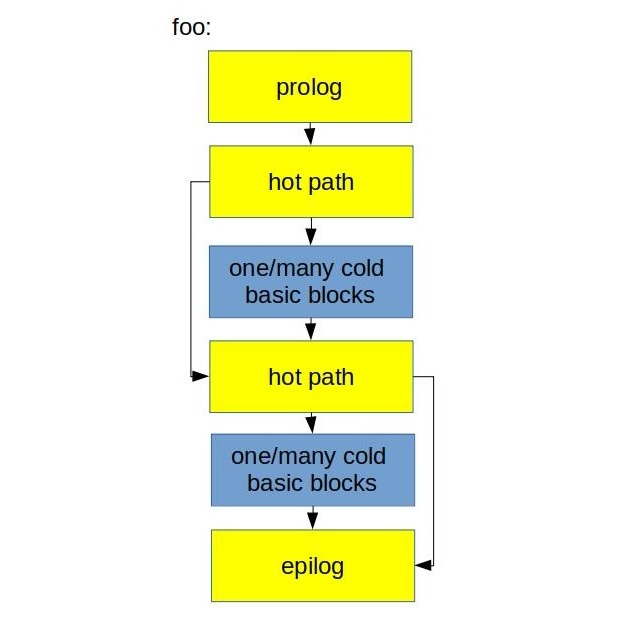
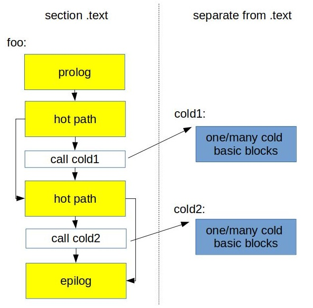

## Function splitting 

The idea behind function splitting[^13] is to separate hot code from the cold. This optimization is beneficial for relatively big functions with complex CFG and big pieces of cold code inside a hot path. An example of code when such transformation might be profitable is shown on [@lst:FunctionSplitting1]. To remove cold basic blocks from the hot path, we could cut and put them into its own new function and create a call to it (see [@lst:FunctionSplitting2]).

Listing: Function splitting: baseline version.

~~~~ {#lst:FunctionSplitting1 .cpp}
void foo(bool cond1, bool cond2) {
  // hot path
  if (cond1) {
    // large amount of cold code (1)
  }
  // hot path
  if (cond2) {
    // large amount of cold code (2)
  }
}
~~~~~~~~~~~~~~~~~~~~~~~~~~~~~~~~~~~~~~~~~~~~~~~~~

Listing: Function splitting: cold code outlined.

~~~~ {#lst:FunctionSplitting2 .cpp}
void foo(bool cond1, bool cond2) {
  // hot path
  if (cond1)
    cold1(); 
  // hot path
  if (cond2)
    cold2(); 
}

void cold1() __attribute__((noinline)) { // cold code (1) }
void cold2() __attribute__((noinline)) { // cold code (2) }
~~~~~~~~~~~~~~~~~~~~~~~~~~~~~~~~~~~~~~~~~~~~~~~~~

Figure @fig:FunctionSplitting gives a graphical representation of this transformation. Because we left just the `CALL` instruction inside the hot path, it's likely that the next hot instruction will reside in the same cache line. This improves the utilization of CPU Front-End data structures like I-cache and DSB.

{#fig:FuncSplit_default width=45%}

{#fig:FuncSplit_better width=45%}

Splitting cold code into a separate function.

This transformation contains another important idea: disable inlining of cold functions. Even if we create a new function for the cold code, the compiler may decide to inline it, which will effectively undo our transformation. This is why we want to use the `noinline` function attribute to prevent inlining. Alternatively, we could apply the `UNLIKELY` macro (see [@sec:secLIKELY]) on both `cond1` and `cond2` branches to convey to the compiler that inlining `cold1` and `cold2` functions is not desired.

Finally, new functions should be created outside of `.text` segment, for example in `.text.cold`. This may improve memory footprint if the function is never called since it won't be loaded into memory in the runtime.

[^13]: Such transformation is also often called "outlining". Readers can find LLVM implementation of this functionality in [lib/Transforms/IPO/HotColdSplitting.cpp](http://llvm.org/doxygen/HotColdSplitting_8cpp_source.html).
