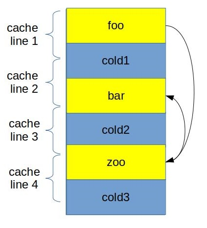
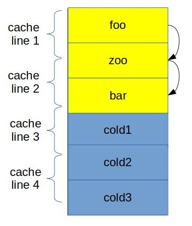

## Function grouping

Following the principles described in previous sections, hot functions can be grouped together to further improve the utilization of caches in the CPU Front-End. When hot functions are grouped together, they might share the same cache line, which reduces the number of cache lines the CPU needs to fetch.

Figure @fig:FunctionGrouping gives a graphical representation of grouping `foo`, `bar`, and `zoo`. The default layout (see fig. @fig:FuncGroup_default) requires four cache line reads, while in the improved version (see fig. @fig:FuncGroup_better), code of `foo`, `bar` and `zoo` fits in only three cache lines. Additionally, when we call `zoo` from `foo`, the beginning of `zoo` is already in the I-cache since we fetched that cache line already.

{#fig:FuncGroup_default width=35%}

{#fig:FuncGroup_better width=32%}

Grouping hot functions together.

Similar to previous optimizations, function grouping improves the utilization of I-cache and DSB-cache. This optimization works best when there are many small hot functions. 

The linker is responsible for laying out all the functions of the program in the resulting binary output. While developers can try to reorder functions in a program themselves, there is no guarantee on the desired physical layout. For decades people have been using linker scripts to achieve this goal. Still, this is the way to go if you are using the GNU linker. The Gold linker (`ld.gold`) has an easier approach to this problem. To get the desired ordering of functions in the binary with the Gold linker, one can first compile the code with the `-ffunction-sections` flag, which will put each function into a separate section. Then [`--section-ordering-file=order.txt`](https://manpages.debian.org/unstable/binutils/x86_64-linux-gnu-ld.gold.1.en.html) option should be used to provide a file with a sorted list of function names that reflects the desired final layout. The same feature exists in the LLD linker, which is a part of LLVM compiler infrastructure and is accessible via the `--symbol-ordering-file` option.

An interesting approach to solving the problem of grouping hot functions together is implemented in the tool called [HFSort](https://github.com/facebook/hhvm/tree/master/hphp/tools/hfsort)[^1]. It is a tool that generates the section ordering file automatically based on profiling data [@HfSort]. Using this tool, Facebook engineers got a 2% performance speedup of large distributed cloud applications like Facebook, Baidu, and Wikipedia. Right now, HFSort is integrated into Facebook's HHVM project and is not available as a standalone tool. The LLD linker employs an implementation[^2] of the HFSort algorithm, which sorts sections based on the profiling data.

[^1]: HFSort - [https://github.com/facebook/hhvm/tree/master/hphp/tools/hfsort](https://github.com/facebook/hhvm/tree/master/hphp/tools/hfsort).

[^2]: HFSort in LLD - [https://github.com/llvm-project/lld/blob/master/ELF/CallGraphSort.cpp](https://github.com/llvm-project/lld/blob/master/ELF/CallGraphSort.cpp).
