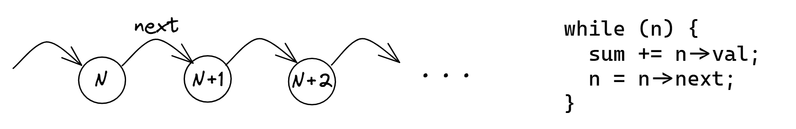

## Data Dependencies

When a program statement refers to the output of a preceding statement, we say that there is a *data dependency* between the two statements. Sometimes people also use the terms _dependency chain_ or *data flow dependencies*. The example we are most familiar with is shown in Figure @fig:LinkedListChasing. To access node `N+1`, we should first dereference the pointer `N->next`. For the loop on the right, this is a *recurrent* data dependency, meaning it spans multiple iterations of the loop. Traversing a linked list is one very long dependency chain.

{#fig:LinkedListChasing width=80%}

Conventional programs are written assuming the sequential execution model. Under this model, instructions execute one after the other, atomically and in the order specified by the program. However, as we already know, this is not how modern CPUs are built. They are designed to execute instructions out-of-order, in parallel, and in a way that maximizes the utilization of the available execution units.

When long data dependencies do come up, processors are forced to execute code sequentially, utilizing only a part of their full capabilities. Long dependency chains hinder parallelism, which defeats the main advantage of modern superscalar CPUs. For example, pointer chasing doesn't benefit from OOO execution and thus will run at the speed of an in-order CPU. As we will see in this section, dependency chains are a major source of performance bottlenecks.

You cannot eliminate data dependencies; they are a fundamental property of programs. Any program takes an input to compute something. In fact, people have developed techniques to discover data dependencies among statements and build data flow graphs. This is called *dependence analysis* and is more appropriate for compiler developers, rather than performance engineers. We are not interested in building data flow graphs for the whole program. Instead, we want to find a critical dependency chain in a hot piece of code, such as a loop or function.

You may wonder: "If you cannot get rid of dependency chains, what *can* you do?" Well, sometimes this will be a limiting factor for performance, and unfortunately, you will have to live with it. But there are cases where you can break unnecessary data dependency chains or overlap their execution. One such example is shown in [@lst:DepChain]. Similar to a few other cases, we present the source code on the left along with the corresponding ARM assembly on the right. Also, this code example is included in the `dep_chains_2`[^] lab assignment of the Performance Ninja online course, so you can try it yourself.

This small program simulates random particle movement. We have 1000 particles moving on a 2D surface without constraints, which means they can go as far from their starting position as they want. Each particle is defined by its x and y coordinates on a 2D surface and speed. The initial x and y coordinates are in the range [-1000,1000] and the speed is in the range [0,1], which doesn't change. The program simulates 1000 movement steps for each particle. For each step, we use a random number generator (RNG) to produce an angle, which sets the movement direction for a particle. Then we adjust the coordinates of a particle accordingly.

Given the task at hand, you decide to roll your own RNG, sine, and cosine functions to sacrifice some accuracy and make it as fast as possible. After all, this is *random* movement, so it is a good trade-off to make. You choose the medium-quality `XorShift` RNG as it only has 3 shifts and 3 XORs inside. What can be simpler? Also, you searched the web and found algorithms for sine and cosine approximation using polynomials, which is accurate enough and quite fast.

We compiled the code using the Clang-17 C++ compiler and ran it on a Mac mini (Apple M1, 2020). Let us examine the generated ARM assembly code:

* The first three `eor` instructions combined with `lsl` or `lsr` correspond to the `XorShift32::gen` function.
* Next `ucvtf` and `fmul` are used to convert the angle from degrees to radians (line 35 in the code).
* Sine and Cosine functions both have two `fmul` instructions and one `fmadd` instruction. Cosine also has an additional `fadd` instruction.
* Finally, we have one more pair of `fmadd` instructions to calculate x and y respectively, and an `stp` instruction to store the pair of coordinates.

We compiled the code using the Clang-17 C++ compiler and ran it on a Mac mini (Apple M1, 2020). You expect this code to "fly", however, there is one very nasty performance problem that slows down the program. Without looking ahead in the text, can you find a recurrent dependency chain in the code?

Listing: Random Particle Motion on a 2D Surface

~~~~ {#lst:DepChain .cpp .numberLines}
struct Particle {                                    │
  float x; float y; float velocity;                  │
};                                                   │
                                                     │
class XorShift32 {                                   │
  uint32_t val;                                      │
public:                                              │
  XorShift32 (uint32_t seed) : val(seed) {}          │
  uint32_t gen() {                                   │
    val ^= (val << 13);                              │
    val ^= (val >> 17);                              │
    val ^= (val << 5);                               │
    return val;                                      │ .loop:
  }                                                  │   eor    w0, w0, w0, lsl #13
};                                                   │   eor    w0, w0, w0, lsr #17
                                                     │   eor    w0, w0, w0, lsl #5
static float sine(float x) {                         │   ucvtf  s1, w0
  const float B = 4 / PI_F;                          │   fmov   s2, w9
  const float C = -4 / ( PI_F * PI_F);               │   fmul   s2, s1, s2
  return B * x + C * x * std::abs(x);                │   fmov   s3, w10
}                                                    │   fadd   s3, s2, s3
static float cosine(float x) {                       │   fmov   s4, w11
  return sine(x + (PI_F / 2));                       │   fmul   s5, s3, s3
}                                                    │   fmov   s6, w12
                                                     │   fmul   s5, s5, s6
/* Map degrees [0;UINT32_MAX) to radians [0;2*pi)*/  │   fmadd  s3, s3, s4, s5
float DEGREE_TO_RADIAN = (2 * PI_D) / UINT32_MAX;    │   ldp    s6, s4, [x1, #0x4]
                                                     │   ldr    s5, [x1]
void particleMotion(vector<Particle> &particles,     │   fmadd  s3, s3, s4, s5
                    uint32_t seed) {                 │   fmov   s5, w13
 XorShift32 rng(seed);                               │   fmul   s5, s1, s5
 for (int i = 0; i < STEPS; i++)                     │   fmul   s2, s5, s2
  for (auto &p : particles) {                        │   fmadd  s1, s1, s0, s2
   uint32_t angle = rng.gen();                       │   fmadd  s1, s1, s4, s6
   float angle_rad = angle * DEGREE_TO_RADIAN;       │   stp    s3, s1, [x1], #0xc
   p.x += cosine(angle_rad) * p.velocity;            │   cmp    x1, x16
   p.y += sine(angle_rad) * p.velocity;              │   b.ne   .loop
  }                                                  │
}                                                    │
~~~~~~~~~~~~~~~~~~~~~~~~~~~~~~~~~~~~~~~~~~~~~~~~~

Congratulations if you've found it. There is a recurrent loop dependency on `XorShift32::val`. To generate the next random number, the generator has to produce the previous number first. The next call of method `XorShift32::gen` will generate the number based on the previous one. Figure @fig:DepChain visualizes the problematic loop-carry dependency. Notice, that the code for calculating particle coordinates (convert the angle to radians, sine, cosine, multiple results by velocity) starts executing as soon as the corresponding random number is ready, but not sooner.

![Visualization of dependent execution in [@lst:DepChain]](../../img/computation-opts/DepChain.png){#fig:DepChain width=90%}

The code that calculates the coordinates of particle `N` is not dependent on particle `N-1`, so it could be beneficial to pull them left to overlap their execution even more. You probably want to ask: "But how can those three (or six) instructions drag down the performance of the whole loop?". Indeed, there are many other "heavy" instructions in the loop, like `fmul` and `fmadd`. However, they are not on the critical path, so they can be executed in parallel with other instructions. And because modern CPUs are very wide, they will execute instructions from multiple iterations at the same time. This allows the OOO engine to effectively find parallelism (independent instructions) within different iterations of the loop. 

Let's do some back-of-the-envelope calculations.[^1] Each `eor` and `lsl` instruction incurs 2 cycles of latency: one cycle for the shift and one for the XOR. We have three dependent `eor + lsl` pairs, so it takes 6 cycles to generate the next random number. This is our absolute minimum for this loop: we cannot run faster than 6 cycles per iteration. The code that follows takes at least 20 cycles of latency to finish all the `fmul` and `fmadd` instructions. But it doesn't matter, because they are not on the critical path. The thing that matters is the throughput of these instructions. A useful rule of thumb: if an instruction is on a critical path, look at its latency, otherwise look at its throughput. On every loop iteration, we have 5 `fmul` and 4 `fmadd` instructions that are served on the same set of execution units. The M1 processor can run 4 instructions per cycle of this type, so it will take at least `9/4 = 2.25` cycles to issue all the `fmul` and `fmadd` instructions. So, we have two performance limits: the first is imposed by the software (6 cycles per iteration due to the dependency chain), and the second is imposed by the hardware (2.25 cycles per iteration due to the throughput of the execution units). Right now we are bound by the first limit, but we can try to break the dependency chain to get closer to the second limit.

One of the ways to solve this would be to employ an additional RNG object so that one of them feeds even iterations and another feeds odd iterations of the loop as shown in [@lst:DepChainFixed]. Notice, that we also manually unrolled the loop. Now we have two separate dependency chains, which can be executed in parallel. One can argue that this changes the functionality of the program, but users would not be able to tell the difference since the motion of particles is random anyway. An alternative solution would be to pick a different RNG that has a less expensive internal dependency chain.

Listing: Random Particle Motion on a 2D Surface
		
~~~~ {#lst:DepChainFixed .cpp}
void particleMotion(vector<Particle> &particles, 
                    uint32_t seed1, uint32_t seed2) {
  XorShift32 rng1(seed1);
  XorShift32 rng2(seed2);
  for (int i = 0; i < STEPS; i++) {
    for (int j = 0; j + 1 < particles.size(); j += 2) {
      uint32_t angle1 = rng1.gen();
      float angle_rad1 = angle1 * DEGREE_TO_RADIAN;
      particles[j].x += cosine(angle_rad1) * particles[j].velocity;
      particles[j].y += sine(angle_rad1)   * particles[j].velocity;
      uint32_t angle2 = rng2.gen();
      float angle_rad2 = angle2 * DEGREE_TO_RADIAN;
      particles[j+1].x += cosine(angle_rad2) * particles[j+1].velocity;
      particles[j+1].y += sine(angle_rad2)   * particles[j+1].velocity;
    }
    // remainder (not shown)
  }
}
~~~~~~~~~~~~~~~~~~~~~~~~~~~~~~~~~~~~~~~~~~~~~~~~~

Once you do this transformation, the compiler starts autovectorizing the body of the loop, i.e., it glues two chains together and uses SIMD instructions to process them in parallel. To isolate the effect of breaking the dependency chain, we disable compiler vectorization. 

To measure the impact of the change, we ran "before" and "after" versions and observed the running time go down from 19ms per iteration to 10ms per iteration. This is almost a 2x speedup. The `IPC` also goes up from 4.0 to 7.1. To do our due diligence, we also measured other metrics to make sure performance hasn't accidentally improved for other reasons. In the original code, the `MPKI` is 0.01, and `BranchMispredRate` is 0.2%, which means the program initially did not suffer from cache misses or branch mispredictions. Here is another data point: when running the same code on Intel's Alderlake system, it shows 74% Retiring and 24% Core Bound, which confirms the performance is bound by computations.

With a few additional changes, you can generalize this solution to have as many dependency chains as you want. For the M1 processor, the measurements show that having 2 dependency chains is enough to get very close to the hardware limit. Having more than 2 chains brings a negligible performance improvement. However, there is a trend that CPUs are getting wider, i.e., they become increasingly capable of running multiple dependency chains in parallel. That means future processors could benefit from having more than 2 dependency chains. As always you should measure and find the sweet spot for the platforms your code will be running on.

Sometimes it's not enough just to break dependency chains. Imagine that instead of a simple RNG, you have a very complicated cryptographic algorithm that is `10,000` instructions long. So, instead of a very short 6-instruction dependency chain, we now have `10,000` instructions standing on the critical path. You immediately do the same change we did above anticipating a nice 2x speedup, but see only slightly better performance. What's going on?

The problem here is that the CPU simply cannot "see" the second dependency chain to start executing it. Recall from Chapter 3, that the Reservation Station (RS) capacity is not enough to see `10,000` instructions ahead as it is much smaller than that. So, the CPU will not be able to overlap the execution of two dependency chains. To fix this, we need to *interleave* those two dependency chains. With this approach, you need to change the code so that the RNG object will generate two numbers simultaneously, with *every* statement within the function `XorShift32::gen` duplicated and interleaved. Even if a compiler inlines all the code and can clearly see both chains, it doesn't automatically interleave them, so you need to watch out for this. Another limitation you may hit while doing this is register pressure. Running multiple dependency chains in parallel requires keeping more state and thus more registers. If you run out of registers, the compiler will start spilling them to the stack, which will slow down the program.

It is worth mentioning that data dependencies can also be created through memory. For example, if you write to memory location `M` on loop iteration `N` and read from this location on iteration `N+1`, there will effectively be a dependency chain. The stored value may be forwarded to a load, but these instructions cannot be reordered and executed in parallel.

As a closing thought, we would like to emphasize the importance of finding that critical dependency chain. It is not always easy, but it is crucial to know what stands on the critical path in your loop, function, or other block of code. Otherwise, you may find yourself fixing secondary issues that barely make a difference.

[^1]: Apple published instruction latency and throughput data in [@AppleOptimizationGuide, Appendix A].
[^2]: Performance Ninja: Dependency Chains 2 - [https://github.com/dendibakh/perf-ninja/tree/main/labs/core_bound/dep_chains_2](https://github.com/dendibakh/perf-ninja/tree/main/labs/core_bound/dep_chains_2)
